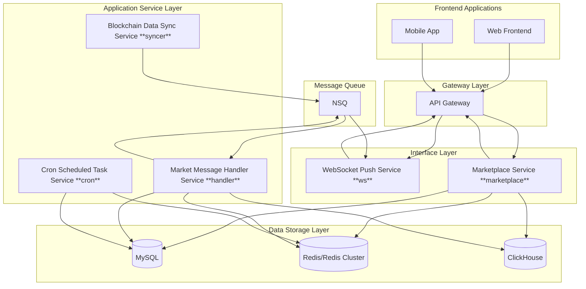

# 1Key Dex Backend System Architecture Document

## System Architecture Diagram

## Service Description

### 1. Core Services

#### WebSocket Service (ws)
- Function: Provides real-time market data push, K-line data, depth data and other WebSocket subscription services
- Communication: WebSocket protocol
- Tech Stack: Socket.IO
- Main Features:
  - Real-time market data push
  - K-line data subscription
  - Depth data subscription
  - Trading pair market subscription

#### Market Service (marketplace)
- Function: Handles exchange market-related business logic
- Main Features:
  - Trading pair management
  - User asset management
  - Order management
  - Trade processing
  - Market data statistics

#### Scheduled Task Service (cron)
- Function: Handles system scheduled tasks
- Main Features:
  - Scheduled data cleanup
  - Statistical tasks
  - System maintenance tasks

#### Data Sync Service (syncer)
- Function: Responsible for data synchronization between different data sources
- Main Features:
  - MySQL to ClickHouse data sync
  - Historical data archiving
  - Data consistency maintenance

#### Market Message Handler Service (handler)
- Function: Processes market messages
- Main Features:
  - Market data processing
  - Market data storage
  - Market data statistics

### 2. Data Storage

#### MySQL
- Usage: Core business data storage
- Main Data:
  - User information
  - Account information
  - Order data
  - Trading pair information
  - System configuration

#### Redis/Redis Cluster
- Usage: Cache and real-time data
- Supports cluster mode
- Main Data:
  - Market cache
  - Real-time order book

#### ClickHouse
- Usage: Analytics data storage
- Main Data:
  - K-line data
  - Trade history
  - Market statistics
  - User behavior analysis

### 3. Communication Methods

1. Internal Service Communication
   - HTTP/HTTPS: RESTful API
   - WebSocket: Real-time data push
   - Redis PubSub: Service message notification
   - NSQ: Message queue
2. External Communication
   - HTTP/HTTPS: RESTful API interface
   - WebSocket: Real-time data subscription

### 4. Deployment Notes

1. Service Scaling
   - WebSocket service can scale horizontally
   - Market service can scale horizontally
   - API gateway supports load balancing

2. Database Scaling
   - MySQL master-slave architecture
   - Redis cluster mode
   - ClickHouse cluster support

3. Monitoring Recommendations
   - Service health checks
   - Database performance monitoring
   - API call monitoring
   - WebSocket connection monitoring
   - System resource monitoring

### 5. Important Considerations

1. High Availability
   - Critical services need redundant deployment
   - Databases need master-slave backup
   - Redis cluster needs proper configuration

2. Security
   - API needs appropriate authentication mechanisms
   - Database access needs strict permission control

3. Performance Optimization
   - Proper use of caching
   - Large data queries using ClickHouse
   - WebSocket connection limits
   - Database connection pool configuration
